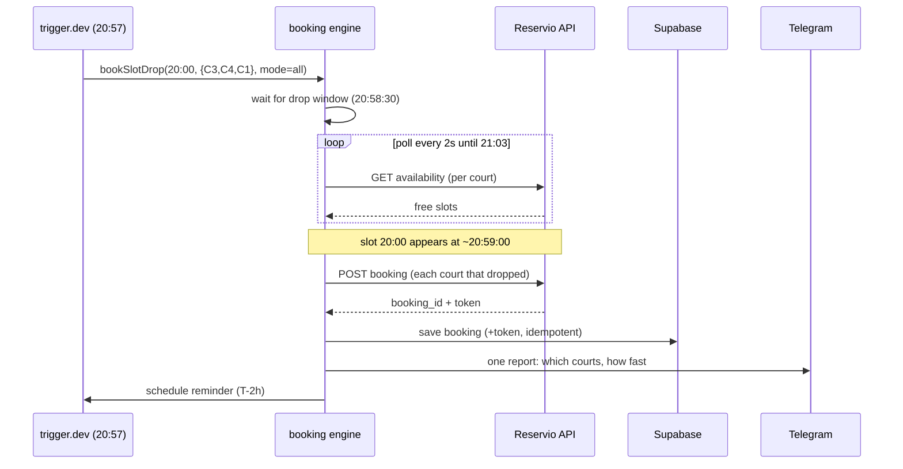

# padel-bot

Autonomous booking bot that wins the nightly race for padel courts at
[Padel Port Batumi](https://padel-port-batumi2.reservio.com), driven from
Telegram.


> A hobby project with a real deadline: the club releases each hour-long slot
> exactly seven days in advance, and the good evening courts are gone within a
> second. This bot reverse-engineers *when* each slot appears and books it
> before a human could tap the screen.

---

## The problem

Padel Port Batumi takes bookings through [Reservio](https://www.reservio.com).
Slots open on a **rolling 7-day horizon, one hour at a time** — and the popular
evening courts are claimed almost instantly. Booking a two-hour evening game by
hand means staying awake, refreshing the widget, and losing anyway.

Two things had to be figured out before any code could win that race:

1. **When exactly does a slot appear?** Reservio's public API only ever returns
   *free* slots — a slot is "available" the moment its `start` string shows up
   in the list. By watching the API to the second across several evenings, the
   drop turned out to follow a precise rule: **the slot for hour `H` on day
   `T+7` appears at `H:59:00 ± 2s` on day `T`** — i.e. exactly `7×24h` before
   the *end* of the slot. (An earlier guess of `(H-1):58` was disproven by the
   very first live measurement; the journal is in
   [docs/PROTOCOL.md](docs/PROTOCOL.md).)

2. **Which courts can you even get?** The club keeps Padel Court 2 and 3 busy
   for 20:00–22:00 on most weekdays (their own sessions), so those hours never
   enter the public drop at all. Confirmed with the club and by the data. So
   instead of chasing one preferred court, the bot runs a **watch set**
   `{Court 3, Court 4, Court 1}` and books *every* court that drops — then the
   owner keeps the two-hour pack on a single court and cancels the rest.

The whole booking pipeline (read → book → cancel) runs as an unauthenticated
guest flow: no login, no OAuth, just the booking's own `token` returned on
creation, which is the only key that can later cancel it.

---

## How it works



**Architectural principle — "Path A": the core is deterministic.** Cron plus
direct Reservio API calls, no LLM and no browser automation in the booking
path. Success is defined only by receiving a `booking_id` from the API —
never by "no error" or "looks like it worked". The one place an LLM appears is
phase 5, purely as a text-to-structure parser for free-form chat queries; it
never decides or performs a booking.

---

## Features

- **Autonomous evenings.** A daily planner (20:30 Tbilisi) posts a pre-drop
  message with a *Skip* button, then schedules the watch runs itself. Every
  night sends **exactly one** Telegram message — success, failure, or
  "skipped" — because a silent failure is treated as the worst possible bug.
- **Multi-court watch.** Books every court in the set that drops, one POST per
  court, so a two-hour pack can be assembled on a single court.
- **Full Telegram UI.** Inline wizards (with breadcrumbs and a *Back* button)
  for viewing bookings, browsing free slots, booking, cancelling, skipping a
  day, and building schedules.
- **Multi-profile.** One bot serves several players, each with their own
  Reservio account, courts, times and Telegram chat. A strict `chat_id`
  allowlist means unknown chats get total silence.
- **Self-service onboarding.** An admin adds a player through a step-by-step
  wizard; the bot hands back a one-time invite link that binds the player's
  chat on first tap.
- **Free-form queries** ("find two consecutive hours Saturday afternoon"),
  parsed by Claude Haiku into a validated intent, then answered by a
  deterministic search over live availability — booking still confirmed by a
  human tap.
- **Reminders & watchdog.** A 2-hour reminder before each game, and a 22:12
  heartbeat that alerts the owner if the evening didn't run, a report never
  reached Telegram, or the bot went dark.

---

## Tech stack

| Concern            | Choice                                                        |
| ------------------ | ------------------------------------------------------------- |
| Language / runtime | TypeScript, Node 20+ (native `fetch`), pnpm                   |
| Scheduling / jobs  | [trigger.dev](https://trigger.dev) (cron + delayed runs)      |
| Shared state       | Supabase Postgres (via PostgREST, plain `fetch` — no SDK)     |
| Telegram           | [grammY](https://grammy.dev) (long-polling)                   |
| LLM (phase 5 only) | Claude Haiku, forced tool-use for structured intent           |
| Bot hosting        | Railway (always-on process)                                   |
| Tests              | Vitest — 919 tests, TZ-pinned, adversarially reviewed         |

The core is written host-agnostically: pure functions plus thin adapters, so
the same `StateStore` interface backs a local SQLite file in tests and Supabase
in the cloud.

---

## Repository layout

```
src/
  reservio/      # API client + types (availability, book, cancel, get)
  core/
    booking-engine.ts   # the watch-and-grab loop, one POST per court
    scheduler.ts        # T+7 drop windows, all math in +04:00
    slot-search.ts      # deterministic consecutive-hour search
    intent.ts           # Haiku parser (forced tool-use)
    state*.ts, repos.ts # Supabase / SQLite / in-memory adapters
    profiles.ts, notify.ts
  bot/           # grammY handlers, wizards, auth allowlist
  trigger/       # trigger.dev tasks: book-drop, daily-planner,
                 #   remind, drop-observe, heartbeat
docs/
  PROTOCOL.md    # reverse-engineered Reservio API v2 + drop journal
  wiki/          # Architecture, Bot, Dev-Process, Runbook, Hosting
supabase/migrations/   # schema history
```

---

## Engineering highlights

A few decisions that make this more than a script:

- **Observability invariant.** Every evening produces exactly one message.
  The 22:12 watchdog cross-checks the planner's actual plan against delivery
  receipts and the bot's pulse — and it's carefully built to avoid the two
  ways a watchdog lies: false alarms *and* false silence.
- **Idempotency under races.** State is keyed `(profile, date, time, court)`;
  the engine re-checks it at start, after sleeping to the window, and right
  before each POST, so a double-trigger never double-books. An ambiguous POST
  failure (timeout / 5xx — the booking *may* have been created) never silently
  advances to another court.
- **A cancel bug that only `state` fixes.** Reservio's cancel is
  `PATCH … state:"canceled"` (one L) and returns `200` with the *old* state if
  you get it wrong — so success is validated on the returned state, not the
  HTTP code. Details live in [docs/PROTOCOL.md](docs/PROTOCOL.md).
- **Privacy by construction.** Contact details, tokens and chat ids never reach
  logs or run output; free-query text that looks like an email or phone number
  is never sent to the LLM.
- **Adversarial testing.** Each feature was reviewed by an independent pass
  hunting for the specific ways it could fail (prompt injection, drop-timing
  off-by-one, silent booking loss, invite brute-force). 919 tests, checked
  non-vacuous by mutation.

---

## Getting started

```bash
pnpm install
cp .env.example .env    # fill in Reservio contact, Supabase, Telegram, trigger.dev
pnpm test               # 919 tests
```

Explore the API safely (no booking is made without an explicit flag):

```bash
npx tsx spike-reservio.ts                 # list Court 3 slots for tomorrow
npx tsx spike-reservio.ts --book          # REAL booking — only run intentionally
npx tsx spike-reservio.ts --cancel <id> --token <token>
```

Run the Telegram bot locally:

```bash
pnpm bot
```

Full setup, deployment and operations are in
[docs/wiki/Runbook.md](docs/wiki/Runbook.md).

---

## Documentation

- [docs/wiki/Home.md](docs/wiki/Home.md) — overview and status
- [docs/wiki/Architecture.md](docs/wiki/Architecture.md) — modules and data flow
- [docs/wiki/Bot.md](docs/wiki/Bot.md) — commands, wizards, authorization
- [docs/wiki/Runbook.md](docs/wiki/Runbook.md) — operations and incident playbook
- [docs/wiki/Hosting.md](docs/wiki/Hosting.md) — hosting comparison and deploy
- [docs/wiki/Dev-Process.md](docs/wiki/Dev-Process.md) — PR workflow and reviews
- [docs/PROTOCOL.md](docs/PROTOCOL.md) — reverse-engineered Reservio API v2

---

## License

[MIT](LICENSE) © 2026 Ilya Nosovsky

This is an independent hobby project and is not affiliated with Reservio or
Padel Port Batumi. Use it against your own account, at your own risk, and don't
hammer anyone's API.
