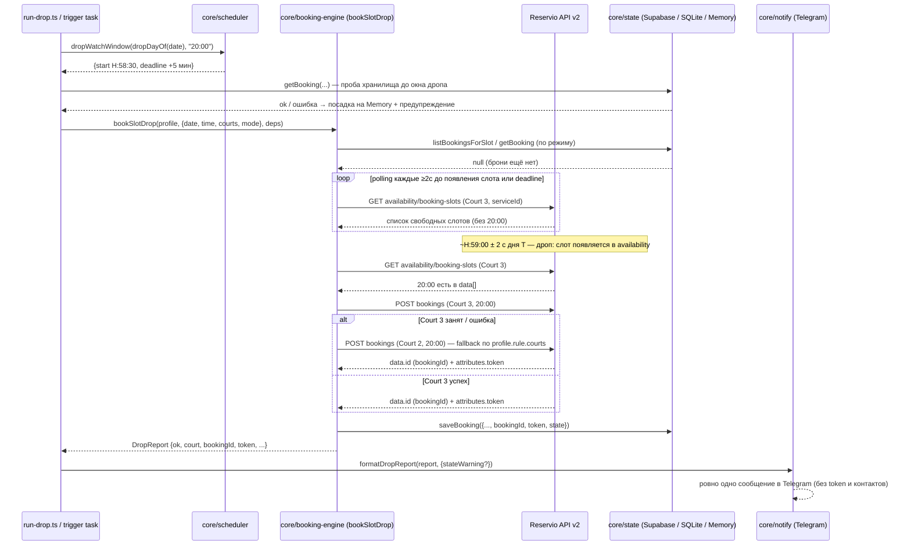

# Architecture

Путь A: детерминированное ядро на TypeScript, прямые вызовы Reservio API v2.
Ни LLM, ни browser-агентов в core-флоу нет (см. `CLAUDE.md`).

## Структура модулей

```
src/
  reservio/client.ts       # ✅ API-клиент: availability, createBooking, cancelBooking, getBooking
  reservio/types.ts        # ✅ типы, businessId, таблица кортов (serviceId/resourceId)
  core/scheduler.ts        # ✅ дроп-окна и датовая арифметика в Asia/Tbilisi
  core/state.ts            # ✅ интерфейс StateStore (async) + MemoryStateStore
  core/state-sqlite.ts     # ✅ SqliteStateStore — единственный импорт better-sqlite3
  core/state-supabase.ts   # ✅ SupabaseStateStore — PostgREST на голом fetch (state облака)
  core/profiles.ts         # ✅ мультипрофили из env (contact + BookingRule)
  core/booking-engine.ts   # ✅ polling + бронь + fallback: bookSlotDrop(profile, target, deps)
  core/notify.ts           # ✅ Telegram: sendTelegram + formatDropReport
  run-drop.ts              # ✅ CLI ручного прогона дропа (dry-run по умолчанию, --live)
  trigger/book-drop.ts     # ✅ таск trigger.dev: дроп + отчёт в Telegram, cron выключен
  bot/                     # ⏳ grammY: команды, кнопки, входящие апдейты (фаза 3)
  index.ts                 # ⏳
trigger.config.ts          # ✅ конфиг trigger.dev (project proj_fxjnzqesxsicrpeuepzv) + syncEnvVars
docs/supabase-schema.sql   # ✅ DDL таблицы bookings для Supabase SQL Editor
spike-reservio.ts          # ✅ ручная проверка протокола / бронь / отмена (фаза 1)
spike-drop-watch.ts        # ✅ наблюдение конкретного дропа + бронь (фаза 1, до run-drop.ts)
tests/                     # ✅ vitest: scheduler, state, state-supabase, profiles, client, engine, notify
docs/PROTOCOL.md           # подтверждённый протокол Reservio API v2
```

✅ реализовано и покрыто тестами · ⏳ ещё не начато (следующие фазы). Статус
актуален на ветке `feat/cloud-drop-telegram`; сверять с `git log`/PR при
существенном расхождении.

## Модули и их роль

**`reservio/client.ts`** (`ReservioClient`) — единственная точка HTTP-общения
с Reservio. Методы: `getAvailability(serviceId, date)`,
`createBooking({serviceId, start, end, contact})`, `cancelBooking(bookingId, token)`,
`getBooking(bookingId, token)`. Таймаут запроса по умолчанию 5 c, до 3 попыток
с экспоненциальным backoff (1 c → 2 c → 4 c…, потолок 30 c, уважает
`Retry-After`) на `429`/`5xx` для GET/PATCH. **`createBooking` никогда не
ретраится** — повтор POST рискует создать дубль брони. Успех брони проверяется
только по наличию `data.id`; успех отмены — только по
`data.attributes.state === "canceled"` в теле ответа, не по HTTP-коду
(`docs/PROTOCOL.md`).

**`reservio/types.ts`** — `businessId`, таблица кортов `COURTS` (имя →
`serviceId`/`resourceId`, данные из `docs/PROTOCOL.md`), `courtByName()`,
типы `Slot`/`BookingCreated`/`ClientContact`.

**`core/scheduler.ts`** — чистая датовая арифметика без `new Date()` без
оффсета: `targetDate(now)` (T+7 в Asia/Tbilisi), `slotStartISO`/`slotEndISO`
(`'2026-08-06'+'20:00'` → `'2026-08-06T20:00:00+04:00'`/`…T20:59:00+04:00'`),
`dropWatchWindow(dayT, time)` → `{start, deadline}` — окно наблюдения дропа
часа `H` начинается в `H:58:30` дня T (тот же час!) и длится 5 минут,
`dropDayOf(date)` — день наблюдения T для целевой даты T+7,
`weekdayOf(date)`/`tbilisiStamp(now)` — день недели и метка времени в +04:00.

**`core/state.ts`** (`StateStore`) — интерфейс
`getBooking(profileId, date, time, court)` (точечно, «занят ли ИМЕННО этот
корт») / `listBookingsForSlot(profileId, date, time)` (весь час по всем кортам)
/ `saveBooking(b)` / `listBookings(profileId?)` / `markCanceled(bookingId)`,
**все методы асинхронные** (`Promise`): под интерфейсом может быть и сеть.
Здесь же `MemoryStateStore` (in-memory `Map`) — и никаких нативных импортов,
поэтому файл спокойно попадает в облачный бандл. Реализации вынесены:
`core/state-sqlite.ts` (`SqliteStateStore`, `better-sqlite3`, `WAL`, файл на
диске — локальные прогоны и тесты) и `core/state-supabase.ts`
(`SupabaseStateStore`, PostgREST на голом `fetch`, без `@supabase/supabase-js`
— общее хранилище облака и будущего бота, DDL в `docs/supabase-schema.sql`).
Ключ дедупликации везде один: `(profileId, date, time, court)` — уникальный
индекс (`bookings_profile_slot_court`, миграция `20260801110000_multicourt.sql`).
Корт в ключе с 01.08.2026: клуб держит Court 2/3 на 20:00–22:00 под свои группы,
вечером в дроп выходит то один корт, то другой, поэтому бот ловит НАБОР кортов и
бронирует каждый появившийся — две брони на один час на разных кортах легитимны,
лишнее владелец отменяет руками. SQLite-файлы старой схемы (`PRIMARY KEY` без
корта) `SqliteStateStore` пересобирает при открытии.
Таблица `settings` (skip-флаги и т.п. из целевой архитектуры фазы 3) пока не
реализована.

**`core/notify.ts`** — исходящий Telegram: `telegramFromEnv(env)` (→ `null`,
если бот не настроен — это не ошибка), `sendTelegram(target, text)`
(`parse_mode=HTML`, таймаут 5 c, никогда не бросает наружу и никогда не
раскрывает botToken, который зашит в URL) и `formatDropReport(report, extra)` —
компактное русское сообщение по `DropReport` без `token` и без контактных
данных профиля.

**`core/profiles.ts`** (`loadProfiles(env)`) — профиль = `{id, label, contact,
telegramChatId?, rule: {times, courts, daysOfWeek?}}`. Профиль по умолчанию
(`id: 'ilya'`) собирается из `CLIENT_NAME/EMAIL/PHONE` с дефолтами
`times: ['20:00','21:00']`, `courts: ['Padel Court 3','Padel Court 2']`.
Дополнительные профили добавляются без изменения кода через
`PROFILE_<K>_NAME/EMAIL/PHONE/TIMES/COURTS` (например, для другого игрока со
своим временем/приоритетом кортов).

**`core/booking-engine.ts`** — экспортирует
`bookSlotDrop(profile, {date, time, courts, mode}, deps: EngineDeps): Promise<DropReport>`
(`EngineDeps = {client, state, now?, sleep?, log?}` — `now`/`sleep`
инжектируются в тестах для детерминизма). Идемпотентность — первым делом:
если непогашенная (`state !== 'canceled'`) запись уже есть — `POST` не
делается вовсе и возвращается `{ok: false, error: {kind: 'AlreadyBooked'}}`.
Проверка идёт по режиму: `listBookingsForSlot(profileId, date, time)` в
`priority` (любая бронь часа блокирует ран) и точечный
`getBooking(profileId, date, time, court)` в `all` (закрывается только этот
корт — брони на разных кортах одного часа легитимны). Та же проверка повторяется
после сна до окна и непосредственно перед каждым `POST` — иначе два прогона,
стартовавшие до окна, создали бы дубль. Окно считается от `dropDayOf(date)`
(целевая дата − 7 суток), а не от «сегодня»; если окно уже закрыто или
откроется позже чем через сутки, движок сразу отдаёт `Timeout` с
объяснением, а не спит неограниченно. Дальше — polling: в каждом раунде проверяются
**все** корты профиля подряд (без пауз между кортами — пауза только между
раундами) и при первом совпадении `start` шлётся `POST` немедленно.
`POST` не ретраится: **одна попытка на корт за запуск**, после исчерпания
попыток polling прекращается досрочно. Детерминированный отказ (`4xx`) →
следующий корт; неоднозначный (таймаут/обрыв/`5xx`/`2xx` без `data.id`) →
в `priority` весь дроп останавливается, потому что бронь могла быть создана
на сервере (вторая попытка означала бы две реальные брони), а в `all`
закрывается только этот корт (остальные — другие ресурсы, дубля на них не
будет) и он помечается `ambiguous` для предупреждения владельцу. Ошибки клиента с
`code=unexpectedResponse` классифицируются как `ApiChanged`, а не как
`Timeout`. У раундов опроса свой
backoff при 429/5xx/сетевых ошибках: 2 c → 4 c → 8 c → 16 c → 30 c (это
отдельный уровень поверх retry внутри самого `reservio/client.ts`).
`DropReport`: `{ok, profileId, date, time, court?, bookingId?, token?,
msFromSeenToBooked?, results: {court, ok, bookingId?, msFromSeenToBooked?,
error?, ambiguous?}[], timeline: {at, event}[], error?: {kind, detail?}}`
(корневые `court`/`bookingId`/`token` — ПЕРВАЯ бронь рана, полная картина по
набору всегда в `results`; `ambiguous` помечает корт, чей `POST` мог всё-таки
создать бронь, — по нему таск шлёт отдельное `⚠️` даже в зелёном отчёте),
`DropErrorKind = 'SlotTaken' | 'ApiChanged' | 'Timeout' | 'AlreadyBooked'`.
Наружу исключения не летят вообще: кривые `date`/`time` и любой сбой `state`
превращаются в `DropReport` (иначе в Telegram не уйдёт ни одного сообщения —
запрещённый проектом молчаливый провал).

**`run-drop.ts`** — CLI ручного прогона одного дропа:
`npx tsx src/run-drop.ts --profile ilya --date YYYY-MM-DD --time HH:MM [--live] [--court "Padel Court 3"] [--force] [--sqlite]`.
Без `--live` — dry-run: весь движок работает по-настоящему (polling, окно,
идемпотентность), но `createBooking` подменён заглушкой, реального `POST` нет,
а state пишется под id `<profile>:dry` и в отдельный файл `state.dry.db`
(фиктивная бронь под боевым ключом заблокировала бы настоящий прогон того же
слота). **State выбирается той же логикой, что и в облачном таске**: заданы
`SUPABASE_URL` + `SUPABASE_SERVICE_ROLE_KEY` → `SupabaseStateStore`, иначе
`SqliteStateStore`. Иначе локальный и облачный прогоны не видели бы броней друг
друга и спокойно создали бы две реальные брони на один слот. `--sqlite` —
аварийный выход на файл, когда Supabase настроен, но недоступен (защиты от
дубля между хостами в этот момент нет, скрипт об этом громко пишет). Дни недели
из `rule.daysOfWeek` проверяются перед запуском (`--force` снимает проверку),
`token` в stdout не печатается — только факт, что он сохранён в state.
Подробности и примеры — `Runbook.md`.

**`trigger/book-drop.ts`** + **`trigger.config.ts`** — таск trigger.dev
`book-slot-drop` (project `proj_fxjnzqesxsicrpeuepzv`), тот же `bookSlotDrop`,
payload `{profileId, date, time, live, force?}`; `concurrencyLimit: 1`,
`maxAttempts: 1`, машина дефолтная, `maxDuration: 600`. **Только ручной
запуск** (дашборд / CLI / `mcp__trigger__trigger_task`, в т.ч. отложенный через
`options.delay`) — никаких `schedules`: cron включается только в фазе 4 после
явного одобрения пользователя. Что таск добавляет поверх движка:

- **выбор state**: есть `SUPABASE_URL` + `SUPABASE_SERVICE_ROLE_KEY` →
  `SupabaseStateStore`, иначе `MemoryStateStore` и предупреждение «state НЕ
  персистентен (Memory)». Первое обращение к Supabase делается **до** окна
  дропа, чтобы «нет таблицы»/«не тот ключ» всплыли заранее. Любой отказ
  хранилища переводит ран на память НАВСЕГДА (в рамках рана) и добавляет
  предупреждение, но **не срывает бронь**: бронь важнее персистентности,
  защита от дубля в этот момент держится на `concurrencyLimit: 1` и
  отключённых ретраях. Таймаут запросов к Supabase здесь укорочен до 1.5 c
  (вместо дефолтных 5 c): движок читает state прямо перед `POST`, уже в горячем
  окне, и зависшее хранилище не имеет права съесть секунды в гонке за корт.
- **token при деградации**: если бронь удалась, а state упал, `saveBooking`
  ушёл в память и умрёт вместе с раном — token не сохранён нигде. В этом (и
  только в этом) случае он остаётся в output рана, а в сообщение добавляется
  строка «отменять только по ссылке из письма». Без этого единственный ключ к
  брони терялся бы совсем.
- **разделение DRY и LIVE**: при `live: false` движок получает профиль с id
  `<profile>:dry`, поэтому фиктивная бронь `dry-…` не занимает боевой ключ
  `(profileId, date, time)` — иначе следующий настоящий прогон того же слота
  вышел бы с `AlreadyBooked`, не сделав ни одного `POST` (та же причина, по
  которой `run-drop.ts` держит отдельный `state.dry.db`).
- **отказ от заведомо провальных ранов**: если до открытия окна больше 4 минут
  (`maxDuration` 600 c минус окно наблюдения и запас), таск падает с подсказкой,
  на какую секунду ставить `delay`. Иначе ран был бы убит по `maxDuration`
  прямо во сне — без брони и без отчёта.
- **ровно одно сообщение в Telegram за ран** — успех, неудача или крах самого
  рана (`try/catch` вокруг всего `run()` шлёт ❌ до проброса ошибки; если
  сломается сам форматтер, уйдёт запасной короткий текст). Отправка делается до
  трёх попыток с паузой 1.5 c: транзиентный 429/502 Telegram не должен
  превращать инвариант в ноль сообщений. Неудача всех попыток ран не роняет, но
  пишется в лог. Адресат — `TELEGRAM_CHAT_ID`, а если у профиля есть свой
  `PROFILE_<K>_TELEGRAM_CHAT_ID`, то он; при мультипрофиле глобального chat_id
  может не быть вовсе — хватает бот-токена и chat_id профиля. Контакт профиля
  (`CLIENT_*`), `token` и значения секретов не попадают ни в лог, ни в output,
  ни в сообщение — текст отчёта и текст любой ошибки проходят через redact.

`trigger.config.ts` дополнительно: `build.external: ['better-sqlite3']`
(нативный модуль не бандлим) и `syncEnvVars` из `@trigger.dev/build` — перед
каждым деплоем читает локальный `.env` своим мини-парсером (без `dotenv`) и
заливает в облако **только** allowlist из семи ключей (`CLIENT_*`,
`SUPABASE_*`, `TELEGRAM_*`), помечая всё кроме `SUPABASE_URL` как secret.
Значения не логируются никогда — только имена недостающих.

**`bot/` (grammY, фаза 3, ещё не начато)** — входящий Telegram-интерфейс:
pre-drop сообщение в 20:45 с кнопками «Пропустить» / «Бронируем», напоминание
T-2ч, команды «Мои брони» / «Отменить сегодняшние». Единственный авторизованный
`chat_id` (env `TELEGRAM_CHAT_ID`) — остальные игнорируются. Исходящий отчёт о
дропе уже работает без бота, через `core/notify.ts`.

## Поток данных на один дроп

1. `scheduler.dropWatchWindow(dropDayOf(date), time)` вычисляет окно наблюдения для часа `H`.
2. `run-drop.ts` (или таск trigger.dev) вызывает `booking-engine.bookSlotDrop`,
   которая с начала окна начинает polling через `reservio/client.getAvailability`.
3. Слот часа `H` появляется в availability → `booking-engine` сверяет с
   `core/state.getBooking(profileId, date, time)`, что дубля не будет, и шлёт
   `POST bookings` на первый корт из `profile.rule.courts` (Court 3), при
   отказе — на следующий (Court 2).
4. Успех (`bookingId` получен) → результат пишется в `core/state` через
   `saveBooking` (в облаке — таблица `bookings` в Supabase).
5. `DropReport` уходит наружу: `run-drop.ts` печатает его в консоль как JSON,
   `trigger/book-drop.ts` — форматирует через `core/notify.formatDropReport` и
   отправляет **ровно одно** сообщение в Telegram (успех/ошибка/крах рана —
   инвариант наблюдаемости из `CLAUDE.md`).

## Дроп-модель (из `docs/PROTOCOL.md`)

Дроп — **почасовой, rolling T+7**: слот на час `H` дня T+7 появляется в
`H:59:00 ± 2 c` дня T — в ТОТ ЖЕ час, что и сам слот. Горизонт ровно 7×24 ч
отсчитывается от КОНЦА слота (`end − 7 суток` = `H:59:00`). Для пары
20:00+21:00 это два отдельных дропа: ~20:59:00 и ~21:59:00 дня T.
Подтверждено живыми замерами 30–31.07.2026: слот
06.08 10:00 отсутствовал в availability в 10:58:49.4 и появился в 10:58:59.9
(`POST` в 10:59:01 → `confirmed`, 1.1 c от появления слота до подтверждённой
брони); 07.08 20:00 на Court 3 появился 31.07 в 20:59:00–01.5 (бронь за
743 мс), 07.08 21:00 на Court 4 — в 21:59:00. Полный журнал замеров —
`docs/PROTOCOL.md`; `booking-engine` начинает polling заранее, с `H:58:30`.
(Формула `(H-1):58:50` из первых редакций доков ошибочна: она противоречит
этому замеру и заставляла поллить за час до дропа.)


