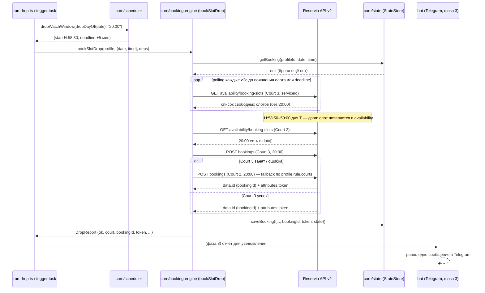

# Architecture

Путь A: детерминированное ядро на TypeScript, прямые вызовы Reservio API v2.
Ни LLM, ни browser-агентов в core-флоу нет (см. `CLAUDE.md`).

## Структура модулей

```
src/
  reservio/client.ts      # ✅ API-клиент: availability, createBooking, cancelBooking, getBooking
  reservio/types.ts        # ✅ типы, businessId, таблица кортов (serviceId/resourceId)
  core/scheduler.ts        # ✅ дроп-окна и датовая арифметика в Asia/Tbilisi
  core/state.ts            # ✅ StateStore: SqliteStateStore (better-sqlite3) + MemoryStateStore
  core/profiles.ts         # ✅ мультипрофили из env (contact + BookingRule)
  core/booking-engine.ts   # ✅ polling + бронь + fallback: bookSlotDrop(profile, target, deps)
  run-drop.ts               # ✅ CLI ручного прогона дропа (dry-run по умолчанию, --live)
  trigger/book-drop.ts     # ✅ таск trigger.dev, ТОЛЬКО ручной запуск, cron выключен
  bot/                     # ⏳ grammY: команды, кнопки, уведомления (фаза 3)
  index.ts                  # ⏳
trigger.config.ts          # ✅ конфиг trigger.dev (project proj_fxjnzqesxsicrpeuepzv)
spike-reservio.ts          # ✅ ручная проверка протокола / бронь / отмена (фаза 1)
spike-drop-watch.ts        # ✅ наблюдение конкретного дропа + бронь (фаза 1, до run-drop.ts)
tests/                      # ✅ vitest: scheduler, state, profiles, reservio-client, booking-engine
docs/PROTOCOL.md           # подтверждённый протокол Reservio API v2
```

✅ реализовано и покрыто тестами · ⏳ ещё не начато (следующие фазы). Статус
актуален на ветке `feat/booking-engine` (фаза 2); сверять с `git log`/PR при
существенном расхождении.

## Модули и их роль

**`reservio/client.ts`** (`ReservioClient`) — единственная точка HTTP-общения
с Reservio. Методы: `getAvailability(serviceId, date)`,
`createBooking({serviceId, start, end, contact})`, `cancelBooking(bookingId, token)`,
`getBooking(bookingId, token)`. Таймаут запроса по умолчанию 5 c, до 3 попыток
с экспоненциальным backoff (1 c → 2 c → 4 c…, потолок 30 c, уважает
`Retry-After`) на `429`/`5xx` для GET/PATCH. **`createBooking` никогда не
ретраится** — повтор POST рискует создать дубль брони. Успех брони проверяется
только по наличию `data.id`; успех отмены — только по
`data.attributes.state === "canceled"` в теле ответа, не по HTTP-коду
(`docs/PROTOCOL.md`).

**`reservio/types.ts`** — `businessId`, таблица кортов `COURTS` (имя →
`serviceId`/`resourceId`, данные из `docs/PROTOCOL.md`), `courtByName()`,
типы `Slot`/`BookingCreated`/`ClientContact`.

**`core/scheduler.ts`** — чистая датовая арифметика без `new Date()` без
оффсета: `targetDate(now)` (T+7 в Asia/Tbilisi), `slotStartISO`/`slotEndISO`
(`'2026-08-06'+'20:00'` → `'2026-08-06T20:00:00+04:00'`/`…T20:59:00+04:00'`),
`dropWatchWindow(dayT, time)` → `{start, deadline}` — окно наблюдения дропа
часа `H` начинается в `H:58:30` дня T (тот же час!) и длится 5 минут,
`dropDayOf(date)` — день наблюдения T для целевой даты T+7,
`weekdayOf(date)`/`tbilisiStamp(now)` — день недели и метка времени в +04:00.

**`core/state.ts`** (`StateStore`) — интерфейс `getBooking(profileId, date, time)`
/ `saveBooking(b)` / `listBookings(profileId?)` / `markCanceled(bookingId)`.
Две реализации: `SqliteStateStore` (файл на диске, `better-sqlite3`, `WAL`,
таблица `bookings` с `PRIMARY KEY (profileId, date, time)` — это и есть
дедупликация) и `MemoryStateStore` (in-memory `Map`, используется в тестах и
в `trigger/book-drop.ts`, где файловая ФС недоступна). Таблица `settings`
(skip-флаги и т.п. из целевой архитектуры фазы 3) пока не реализована.

**`core/profiles.ts`** (`loadProfiles(env)`) — профиль = `{id, label, contact,
telegramChatId?, rule: {times, courts, daysOfWeek?}}`. Профиль по умолчанию
(`id: 'ilya'`) собирается из `CLIENT_NAME/EMAIL/PHONE` с дефолтами
`times: ['20:00','21:00']`, `courts: ['Padel Court 3','Padel Court 2']`.
Дополнительные профили добавляются без изменения кода через
`PROFILE_<K>_NAME/EMAIL/PHONE/TIMES/COURTS` (например, для другого игрока со
своим временем/приоритетом кортов).

**`core/booking-engine.ts`** — экспортирует
`bookSlotDrop(profile, {date, time}, deps: EngineDeps): Promise<DropReport>`
(`EngineDeps = {client, state, now?, sleep?, log?}` — `now`/`sleep`
инжектируются в тестах для детерминизма). Идемпотентность — первым делом:
если в `state.getBooking(profileId, date, time)` уже есть непогашенная
(`state !== 'canceled'`) запись, `POST` не делается вовсе, возвращается
`{ok: false, error: {kind: 'AlreadyBooked'}}`. Та же проверка повторяется
после сна до окна и непосредственно перед каждым `POST` — иначе два прогона,
стартовавшие до окна, создали бы дубль. Окно считается от `dropDayOf(date)`
(целевая дата − 7 суток), а не от «сегодня»; если окно уже закрыто или
откроется позже чем через сутки, движок сразу отдаёт `Timeout` с
объяснением, а не спит неограниченно. Дальше — polling: в каждом раунде проверяются
**все** корты профиля подряд (без пауз между кортами — пауза только между
раундами) и при первом совпадении `start` шлётся `POST` немедленно.
`POST` не ретраится: **одна попытка на корт за запуск**, после исчерпания
попыток polling прекращается досрочно. Детерминированный отказ (`4xx`) →
следующий корт; неоднозначный (таймаут/обрыв/`5xx`/`2xx` без `data.id`) →
весь дроп останавливается, потому что бронь могла быть создана на сервере
(вторая попытка означала бы две реальные брони). Ошибки клиента с
`code=unexpectedResponse` классифицируются как `ApiChanged`, а не как
`Timeout`. У раундов опроса свой
backoff при 429/5xx/сетевых ошибках: 2 c → 4 c → 8 c → 16 c → 30 c (это
отдельный уровень поверх retry внутри самого `reservio/client.ts`).
`DropReport`: `{ok, profileId, date, time, court?, bookingId?, token?,
msFromSeenToBooked?, timeline: {at, event}[], error?: {kind, detail?}}`,
`DropErrorKind = 'SlotTaken' | 'ApiChanged' | 'Timeout' | 'AlreadyBooked'`.
Наружу исключения не летят вообще: кривые `date`/`time` и любой сбой `state`
превращаются в `DropReport` (иначе в Telegram не уйдёт ни одного сообщения —
запрещённый проектом молчаливый провал).

**`run-drop.ts`** — CLI ручного прогона одного дропа:
`npx tsx src/run-drop.ts --profile ilya --date YYYY-MM-DD --time HH:MM [--live] [--court "Padel Court 3"] [--force]`.
Без `--live` — dry-run: весь движок работает по-настоящему (polling, окно,
идемпотентность), но `createBooking` подменён заглушкой, реального `POST` нет,
а state пишется в отдельный файл `state.dry.db` (фиктивная бронь в боевом
`state.db` заблокировала бы настоящий прогон того же слота). Дни недели из
`rule.daysOfWeek` проверяются перед запуском (`--force` снимает проверку),
`token` в stdout не печатается. Подробности и примеры — `Runbook.md`.

**`trigger/book-drop.ts`** + **`trigger.config.ts`** — таск trigger.dev
`book-slot-drop` (project `proj_fxjnzqesxsicrpeuepzv`), тот же `bookSlotDrop`,
payload `{profileId, date, time, live, force?}`; `concurrencyLimit: 1`,
контакт профиля и `token` в логи/output не попадают. **Только ручной запуск** (дашборд /
CLI / `mcp__trigger__trigger_task`) — `dirs`/`maxAttempts: 1` в конфиге, никаких
`schedules`. В облаке используется `MemoryStateStore` (файловый SQLite
недоступен на воркерах) — состояние не переживает рестарт/следующий запуск;
идемпотентность между отдельными запусками таска пока не гарантирована
(TODO фазы 4 — внешняя БД, например Turso/libSQL). Cron/schedules включаются
только в фазе 4 после явного одобрения пользователя.

**`bot/` (grammY, фаза 3, ещё не начато)** — Telegram-интерфейс: pre-drop
сообщение в 20:45 с кнопками «Пропустить» / «Бронируем», результат в 21:0x,
напоминание T-2ч, команды «Мои брони» / «Отменить сегодняшние». Единственный
авторизованный `chat_id` (env `TELEGRAM_CHAT_ID`) — остальные игнорируются.

## Поток данных на один дроп

1. `scheduler.dropWatchWindow(dropDayOf(date), time)` вычисляет окно наблюдения для часа `H`.
2. `run-drop.ts` (или таск trigger.dev) вызывает `booking-engine.bookSlotDrop`,
   которая с начала окна начинает polling через `reservio/client.getAvailability`.
3. Слот часа `H` появляется в availability → `booking-engine` сверяет с
   `core/state.getBooking(profileId, date, time)`, что дубля не будет, и шлёт
   `POST bookings` на первый корт из `profile.rule.courts` (Court 3), при
   отказе — на следующий (Court 2).
4. Успех (`bookingId` получен) → результат пишется в `core/state` через
   `saveBooking`; в фазе 3 `bot/` будет отправлять по этому отчёту ровно одно
   сообщение в Telegram (успех/частичный успех/ошибка — инвариант
   наблюдаемости из `CLAUDE.md`). Сейчас (фаза 2) отчёт печатается в консоль
   `run-drop.ts` как JSON.

## Дроп-модель (из `docs/PROTOCOL.md`)

Дроп — **почасовой, rolling T+7**: слот на час `H` дня T+7 появляется в
`H:58:50–59:00` дня T — в ТОТ ЖЕ час, что и сам слот. Горизонт ровно 7×24 ч
отсчитывается от КОНЦА слота (`end − 7 суток` = `H:59:00`). Для пары
20:00+21:00 это два отдельных дропа: ~20:58:50 и ~21:58:50 дня T.
Подтверждено живым наблюдением 30.07.2026: слот
06.08 10:00 отсутствовал в availability в 10:58:49.4 и появился в 10:58:59.9;
`POST` в 10:59:01 → `confirmed` (1.1 c от появления слота до подтверждённой
брони). Разброс секунд уточняется дальнейшими наблюдениями, поэтому
`booking-engine` начинает polling заранее — с `H:58:30`.
(Формула `(H-1):58:50` из первых редакций доков ошибочна: она противоречит
этому замеру и заставляла поллить за час до дропа.)


